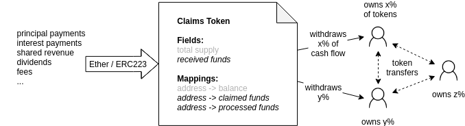

---

eip: ERC-xxxx  
title: Claims Token Standard  
author: Johannes Pfeffer ([@jo-tud](https://github.com/jo-tud)), Johannes Escherich ([@jo-es](https://github.com/jo-es)), ...  
discussions-to: #xxxx  
status: Draft  
type: Standards Track  
category: ERC  
created: 2019-03-01  
require: ERC-20 (#20), ERC-223 (#223)  

---

# DRAFT! Claims Token EIP

## Simple Summary
A standard for a token that represents claims on future cash flow of an asset such as dividends, loan repayments, fee or revenue shares among large numbers of token holders. 

- Efficient handling of fractional ownership of cash-flow claims
- Correctly distributes cash flow honoring all token transfers
- Scales well to many token holders and frequent transfers
- Takes care of claims to past cash flows by dynamically accounting for token transfers
- Fully ERC-20 compliant
- Supports funds in Ether or in ERC223 compatible tokens
- Total supply must be immutable


## Abstract


This standard proposes an efficient solution for distributing recurring payments such as dividends, loan repayments, fee or revenue shares among large numbers of token holders. The token holders are seen as fractional owners of future cash flow. The payments can be in Ether or ERC20 tokens and are stored in the token's "fund". Holders of a claims token can transfer their tokens at any time and can still be sure that their past claims to the cash flow of the token will be honored. The interface provides methods to deposit funds to be distributed, to get information about available funds and to withdraw funds a token holder is entitled to.

This standard can handle funds in Ether or in ERC223 compatible tokens.

This standard is backwards compatible with ERC20 (#20) and can easily be extended to be compatible with ERC-1400 (#1411) security token standards.

## Motivation
In the DeFi and OpenFinance ecosystem assets such as debt positions, loans, derivatives and bonds are emerging. These assets incur future cash flows, e.g. repayments or dividends. Currently there is no standard for efficiently distributing claims on future cash flow of financial contracts among token holders.

## Rationale
Sending cash flow to a large group of token holders whenever it is received is limited by gas consumption. Thus, a solution must be used in which token holders actively withdraw the cumulative funds that they have a claim on. A token holder must be able to withdraw funds she has a claim on at any time. It must also be possible to transfer tokens at any time and the already accrued claims must still be honored. This requires some background accounting to be done in the transfer functions. The claims token standard solves this elegantly.

Example: A bond is represented by 100 tokens. Alice owns all 100 of these tokens and Bob own zero. The bond yields 10 Ether. Alice has a claim on 100% of that cash flow because when the 10 Ether were received she owned all the tokens. She decides to not withdraw the tokens but wait until more has accumulated.

Now Alice sends 50 tokens to Bob. Shortly after the bond yield another 10 Ether. Now Alice has is entitled to 15 Ether and Bob to 5 Ether. The ownership history is honored and Alice doesn't need to withdraw before she transfers the tokens.

## Requirements

### Requirements a claims token should fulfill

Executing tokenized financial contracts on a public ledger requires standards for distribution of cash flow incurred by the asset. In discussions with issuers the following requirements have been collected.

- MUST be ERC-20 compatible.
- MUST support a large number of token holders that hold claims on an assets cash flow
- MUST support efficient withdrawal of available funds
- MUST support efficient addition of funds to be distributed
- clients/token holders MUST be able to observe new deposits to the fund

### Requirements to observe when using the standard

The following requirements MUST be met in order to use the claims token standard.

- The extended token MUST be ERC-20 compatible
- The token in which funds are deposited MUST be specified before the first deposit.
- The extended token MUST have a fixed total supply. After the first token transfer the total supply MUST NOT be changed.
- IF the funds are payed in ERC20 tokens (and not in Ether), this token MUST comply to ERC223


## Specification

### Methods

#### default function
The default function behaves differently if Ether or tokens are sent to the contract.

In case of funds in Ether any Ether sent to the contract will be added to the fund by the default function.

In case of funds in ERC20/223 tokens the token that is registered will be added to the fund by the default function when it's sent to the contract.


#### totalReceivedFunds
The monotonously rising cumulative sum of funds received since the creation of the token. This number is the amount that the contract has had available for distribution so far.

```
totalReceivedFunds() external view returns (uint256);
```

#### availableFunds
Returns the amount of funds that can be withdrawn by a current or former token holder given as the `_address` parameter.

```
availableFunds(address _address) external view returns (uint256);
```

#### withdrawFunds
Withdraws the funds the message sender is entitled to at the time of execution of the function.

```
function withdrawFunds() external payable;
```


### fundsToken
A field that stores a reference to the token used for the funds. In case of funds in Ether, the field must be set to `0x0`.

## Interface
```
/// @title IERCxxxx Claims Token Standard
/// @dev See https://github.com/atpar/claims-token

interface IClaimsToken {

	event Deposit(uint256 fundsDeposited);
	
	/**
	 * @dev Withdraws available funds for user.
	 */
	function withdrawFunds() external payable;

	/**
	 * @dev Returns the amount of funds a given address is able to withdraw currently.
	 * @param _forAddress Address of ClaimsToken holder
	 * @return A uint256 representing the available funds for a given account
	 */
	function availableFunds(address _forAddress) external view returns (uint256);

	/**
	 * @dev Get cumulative funds received by ClaimsToken.
	 * @return A uint256 representing the total funds received by ClaimsToken
	 */
	function totalReceivedFunds () external view returns (uint256);
}

```

## Implementation

The reference implementation consists of the accounting contract and two specializations. The first is for funds denoted in Ether and the second is for funds denoted in ERC20/ERC223 compatible tokens.

- [Reference implementation for cash flow in ERC20/ERC223 tokens](https://github.com/atpar/claims-token/blob/EIP-DRAFT/contracts/ClaimsTokenETHExtension.sol)
- [Reference implementation for cash flow in Ether](https://github.com/atpar/claims-token/blob/EIP-DRAFT/contracts/ClaimsTokenETHExtension.sol)

The claims token is realized by implementing the transfer functions to do the necessary accounting on two additional mappings (`processedFunds` & `claimedFunds`). A `uint256` is introduced to track the total amount of funds sent to the token contract (`receivedFunds`).

### Calculation of the available funds
The high efficiency of the solution is achieved by tracking 2 values for each token holder: `claimedFunds` and `processedFunds`. By updating these at transfer events and postponing calculation of available funds to withdrawal time, this implementation achieves very low gas cost for both transfers and withdrawals.

__Terms:__  
`balance_A` -> Balance of token owner A  
`claimedFunds_A` -> Amount of funds owned by A that is already claimed  
`receivedFunds` -> Total cumulative sum of funds received for distribution (monotonously rising)  
`processedFunds_A`-> This value tracks the amount of funds for which a user has already claimed their portion of the cash flow  
`unprocessedFunds_A` -> Represents the amount of funds for which a user holds a claim but that were not yet processed  
`ownershipFraction_A` -> Percentage of cash-flow that can be claimed by A  
`totalSupply`-> Total and immutable amount of minted tokens  
`availableFunds_A` -> The amount of funds token holder A can withdraw  

__Calculations:__  
The ownership fraction is the balance relative to the total supply.  
`ownershipFraction_A = balance_A/totalSupply`

The available funds are calculated as the sum of the unprocessed funds and the claimed funds. Unprocessed funds are calculated by multiplying the ownership fraction with the difference between the total received funds and the fund that have already been considered for a user (`processedFunds`)  

`unprocessedFunds_A = ownershipFraction_A * (receivedFunds-processedFunds_A)`  
`availableFunds_A = unprocessedFunds_A + claimedFunds_A`  

## Example
Total supply: 100 tokens  
Initial distribution: Alice owns 100 tokens and Bob owns 0 tokens. 0 funds received.

Step | balance Alice | balance Bob | funds available Alice | funds available Bob | funds received | event
---- | --------- | --------- | ----------------- | ----------------- | -------------- | ---
0    | 100       | 0         | 0                 | 0                 | 0              | token creation
1    | 100       | 0         | 20                | 0                 | 20             | 20 Ether sent to the contract
2    | 75        | 25        | 20                | 0                 | 20             | Alice has sent 25 tokens to Bob
3    | 75        | 25        | 35                | 5                 | 40             | 20 Ether sent to the contract
4    | 75        | 25        | 0                 | 5                 | 40             | Alice withdraws her funds
5    | 75        | 25        | 12                | 9                 | 56             | 16 Ether sent to the contract
6    | 50        | 50        | 12                | 9                 | 56             | Alice has sent 25 tokens to Bob
7    | 50        | 50        | 16                | 13                | 64             | 8 Ether sent to the contract
8    | 50        | 0         | 16                | 13                | 64             | Bob has sent 50 tokens to X

The Claims Token accounting system works in the background to take care of the fact that Alice's claims fraction changes and Bob sends his tokens away before withdrawing his available funds.

## Attribution
The idea for the implementation of the claims token goes back to work originally done by [@Georgi87](https://github.com/Georgi87), [@ethers](https://github.com/ethers), [@miladmostavi](https://github.com/miladmostavi) and [@popra](https://github.com/popra) and was used in the [Tokit SingularDTVFund](https://github.com/Digital-Mob/singulardtv-tokitio-contracts) contracts.

